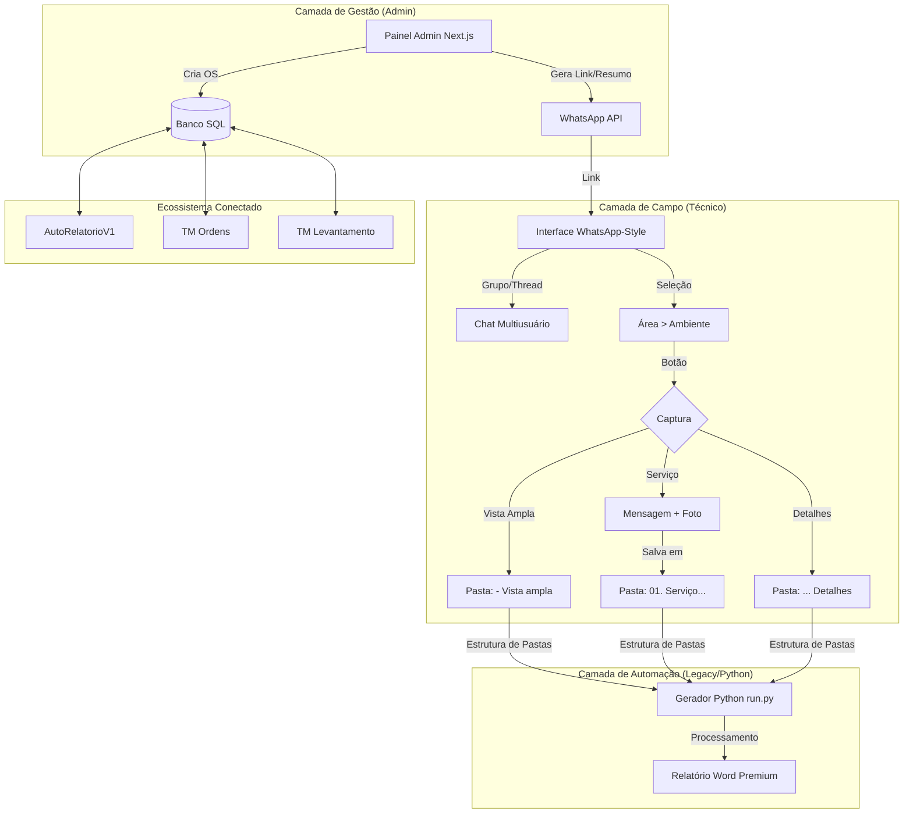

# 🗺️ Mapa da Ideia: Ecossistema TM-OS (Recalibrado)

O sistema foi concebido como a "Ponte de Inteligência" entre a gestão administrativa e a execução em campo, garantindo que os dados capturados pelo técnico alimentem automaticamente o gerador de relatórios sem necessidade de intervenção manual.

## 🎨 Design System: "Sober & Professional"
Baseado na estética **WhatsApp Modern UI**, com cores que conectam à identidade do **Auto Relatório**.

| Elemento | Especificação |
| :--- | :--- |
| **Tipografia** | Inter (Interface), DM Sans (Conexão Auto Relatório) |
| **Paleta** | Slate 900 (Primária), Emerald 600 (Conexão Auto Relatório), Gray 50 (Fundo) |
| **Estilo** | Chat Thread (Estilo WhatsApp) com balões de mensagem limpos |
| **Bordas** | 12px (Premium Rounded) |

## 🚀 Fluxo do Usuário (Técnico)
1. **Recebimento:** Abre o link da OS direto do WhatsApp (Auth Simplificada).
2. **Setup Logístico:** Seleciona a **Área** (ex: Área Externa) e o **Ambiente** (ex: Jardim).
3. **Execução:**
   - **Vista Ampla:** Tira foto panorâmica do ambiente clicando no botão.
   - **Serviço:** Escreve no chat a descrição do serviço + tira a foto.
   - **Detalhes:** Tira fotos de detalhes adicionais conforme necessário.
4. **Finalização:** Sistema organiza os arquivos automaticamente conforme a estrutura do `run.py`.
