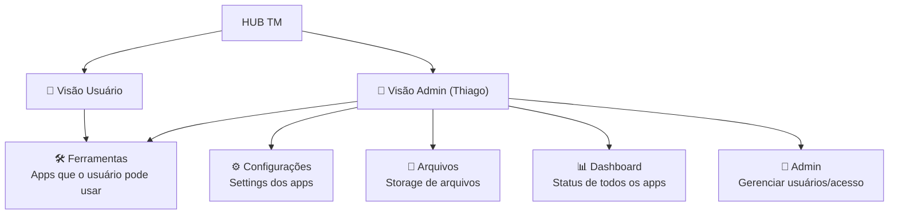

# HUB TM — Organização da Ideia + Plano de Implementação

## Contexto

O [HUb-client.html](file:///c:/Users/thiag/TM-MEUS-APPS/HUb-client.html) é um **painel central de utilidades** (estilo iLovePDF) que serve como ponto de entrada para acessar as aplicações Next.js da TM. Atualmente é um HTML estático com cards bonitos, mas sem funcionalidade real de conexão com os apps.

## Aplicações Next.js Descobertas

| App | Pasta | Descrição |
|-----|-------|-----------|
| **Bot Chat** | `Bot-chat-next.js` | Chat bot com IA |
| **G-2** | `G-2` | Gerenciador V2 |
| **TM Comparador** | `TM Comparador` | Comparador Excel × DOCX |
| **TM Ordens** | `TM Ordens` | Gerenciador de Ordens de Serviço |
| **TM Pastas** | `TM Pastas` | Gerador de Pastas |
| **TM Relatorio** | `TM Relatorio` | Gerador de Relatórios DOCX |

## Organização da Ideia: Duas Visões

### 👤 Visão Usuário (Ferramentas)
O que os usuários comuns veem ao acessar o Hub:
- **Grid de ferramentas** — Cards das apps disponíveis (como o iLovePDF)
- **Barra de busca** — Filtrar ferramentas por nome/categoria
- **Categorias** — Documentos, Análise, Gestão, Utilidades
- **Favoritos** — Marcar apps como favoritos
- Ao clicar num card → abre o app Next.js correspondente (em nova aba ou em iframe)

### 🔐 Visão Admin (Thiago)
Tudo que o usuário vê, **mais**:
- **Dashboard** — Status de cada app (online/offline), estatísticas de uso
- **Configurações** — Configurações globais e por app
- **Arquivos** — Área de armazenamento de arquivos e templates
- **Gerenciar Apps** — Adicionar/remover/editar apps no painel
- **Segurança** — Controle de acesso

## User Review Required

> [!IMPORTANT]
> **Decisão necessária**: O Hub atual é um arquivo HTML estático. Para implementar autenticação (admin vs. usuário) e storage de arquivos, temos **duas opções**:

### Opção A: Hub como HTML Estático (Simples)
- Mantém o [HUb-client.html](file:///c:/Users/thiag/TM-MEUS-APPS/HUb-client.html) como está
- Adiciona um **toggle Admin/Usuário** no cabeçalho (sem autenticação real, apenas visual)
- Cada card abre o app Next.js correspondente via `run_app.bat` (o usuário já roda tudo local)
- **Prós**: Rápido de implementar, sem backend extra
- **Contras**: Sem autenticação real, sem storage de arquivos, tudo local

### Opção B: Hub como App Next.js (Completo)
- Cria um novo projeto Next.js para o Hub
- Autenticação real com login (admin/usuário)
- API para verificar status dos apps
- Storage de arquivos integrado
- **Prós**: Solução completa e escalável
- **Contras**: Mais complexo, precisa de mais tempo

> [!IMPORTANT]
> Qual opção você prefere? Ou alguma combinação? Me diga e eu implemento.

## Proposed Changes (para Opção A — versão rápida)

### HUB Client

#### [MODIFY] [HUb-client.html](file:///c:/Users/thiag/TM-MEUS-APPS/HUb-client.html)

1. **Toggle Admin/Usuário** no header — botão que alterna entre as duas visões
2. **Cards atualizados** para refletir os 6 apps Next.js reais, com:
   - Nomes corretos
   - Descrições atualizadas
   - Portas corretas (cada app roda numa porta diferente)
   - Links que abrem `http://localhost:PORTA` ao clicar
3. **Sidebar funcional**:
   - Na visão **Usuário**: mostra apenas "Ferramentas" e "Categorias"
   - Na visão **Admin**: mostra tudo (Dashboard, Ferramentas, Configurações, Arquivos, Segurança)
4. **Seção Admin-only**: painel com status dos apps, configuração de portas

## Verification Plan

### Manual Verification
1. Abrir o [HUb-client.html](file:///c:/Users/thiag/TM-MEUS-APPS/HUb-client.html) no navegador
2. Verificar que os 6 cards aparecem na visão padrão
3. Alternar para visão Admin e verificar que itens extras aparecem na sidebar
4. Clicar no toggle para voltar à visão Usuário e verificar que os itens admin somem
5. Clicar num card e verificar que abre a URL correta
